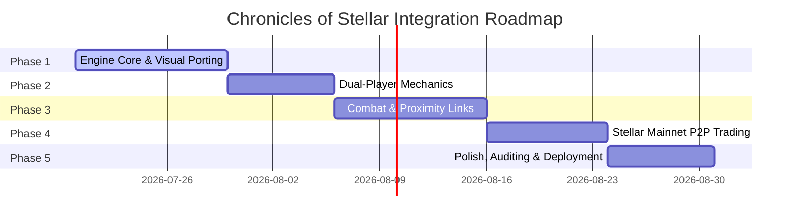

# 🗺️ 5-Phase Development Roadmap & Architecture

This document presents the technical architecture and roadmap for integrating the mechanics from **KickPunch (game-off-2017)** into the **Chronicles of Stellar** Web3 RPG. It details how the system scales over five distinct phases, moving from initial asset migration to a live, production-grade Mainnet deployment.

---

## 📐 System Architecture Overview

```mermaid
graph TD
    subgraph Client Layer (React & Phaser)
        P_Engine["Phaser v4 Physics Engine (CanvasManager.ts)"]
        UI_HUD["React HUD View (GameScreen.tsx)"]
        Event_Broker["Asynchronous EventHub (EventHub.ts)"]
    end

    subgraph Logic & State Layer
        State_Mgr["NPC Dialogue State (TerminalLogic.ts)"]
        Combat_FSM["State Machine (Player States)"]
    end

    subgraph External Services Layer
        AI_Bridge["Google Gemini API (AgentBridge.ts)"]
        Stellar_Horizon["Stellar Horizon Mainnet (StellarClient.ts)"]
        Freighter_Wallet["Freighter Wallet (User Agent)"]
    end

    %% Connections
    P_Engine -->|Event Triggers| Event_Broker
    UI_HUD -->|Action Commands| Event_Broker
    Event_Broker -->|State Updates| UI_HUD
    Event_Broker -->|Physics Mutations| P_Engine
    
    P_Engine --> Combat_FSM
    UI_HUD --> State_Mgr
    
    State_Mgr --> AI_Bridge
    UI_HUD --> Freighter_Wallet
    Freighter_Wallet -->|Signed XDR| Stellar_Horizon
    Stellar_Horizon -->|Tx Confirmation| Event_Broker
```

---

## 📅 The 5-Phase Roadmap



---

## 🛠️ Phase Details & Implementation Blueprints

### 🟢 Phase 1: Engine Core & Visual Porting
*   **Objective**: Re-architect KickPunch's asset loaders, tiled platform maps, and sprite animations to fit the React + TypeScript structure of *Chronicles of Stellar*.
*   **Key Deliverables**:
    *   **Phaser v4 Asset Pipeline**: Migrate PNG spritesheets, retro backgrounds, and Game Boy green palette styling elements to `/src/assets/`.
    *   **Level Builder Porting**: Replace procedural canvas generations in [CanvasManager.ts](file:///Users/noname/documents/Chronichles-of-Stellar-./src/engine/CanvasManager.ts) with textured, scrolling grid layers and parallax skyline assets.
    *   **State Class Structure**: Refactor legacy Phaser 2 states (Boot, Preload, Play) into native TypeScript class methods running inside the Phaser v4 scene lifecycle (`preload`, `create`, `update`).

---

### 🟡 Phase 2: Dual-Player Mechanics (Local Co-op)
*   **Objective**: Implement local co-op controls enabling two players to navigate the grid simultaneously on the same screen.
*   **Key Deliverables**:
    *   **Input Separation**: Bind Player 1 to standard Arrow Keys and Player 2 to WASD controls in [CanvasManager.ts](file:///Users/noname/documents/Chronichles-of-Stellar-./src/engine/CanvasManager.ts).
    *   **Midpoint Camera Tracking**: Update [ParallaxController.ts](file:///Users/noname/documents/Chronichles-of-Stellar-./src/engine/ParallaxController.ts) to calculate and scroll background elements based on the mathematical midpoint of both players, preventing them from falling off-screen.
    *   **Player-to-Player Physics**: Implement arcade physics colliders so player sprites can stand on, push, or jump off of each other.

---

### 🟠 Phase 3: Combat, State Machine & Proximity Links
*   **Objective**: Port KickPunch's arcade combat system (hitboxes, attacks, damage metrics) and set up multi-player interaction prompts for NPCs.
*   **Key Deliverables**:
    *   **Player State Machine (FSM)**: Code active states (`idle`, `walk`, `attack_punch`, `attack_kick`, `hitstun`, `knockback`) for both players.
    *   **AABB Bounding Box Hitboxes**: Implement standard hitbox checking on attack frames using Phaser overlapping checks:
        ```typescript
        this.physics.add.overlap(player1.attackHitbox, player2, handleCombatHit);
        ```
    *   **Proximity HUD Triggers**: Extend the [EventHub.ts](file:///Users/noname/documents/Chronichles-of-Stellar-./src/events/EventHub.ts) channels so if *either* Player 1 or Player 2 walks near an NPC, the HUD displays their corresponding dialogue link.

---

### 🔴 Phase 4: Stellar Mainnet P2P Trading
*   **Objective**: Implement secure, live mainnet peer-to-peer trading of XLM and custom items between the two players.
*   **Key Deliverables**:
    *   **Mainnet RPC Switch**: Reconfigure [StellarClient.ts](file:///Users/noname/documents/Chronichles-of-Stellar-./src/blockchain/StellarClient.ts) and [WalletConnector.ts](file:///Users/noname/documents/Chronichles-of-Stellar-./src/blockchain/WalletConnector.ts) to interact with the live `horizon.stellar.org` cluster.
    *   **Atomic Multi-Operation Transactions**: Construct payments that execute on-chain transfers of native XLM using `Operation.payment` and update custom inventory metadata using `Operation.manageData` in a single ledger block.
    *   **Freighter Wallet Lock**: Block local key storage. Require user signatures via Freighter Wallet with network passphrase checks set strictly to `Networks.PUBLIC`.

---

### 🔵 Phase 5: Polish, Auditing & Deployment
*   **Objective**: Optimize asset delivery, secure the game against frontend vulnerabilities, and host the web application for production.
*   **Key Deliverables**:
    *   **Audio Manager**: Port retro sound effects (punch, hit, jump, contract confirmed) using Phaser's Web Audio API wrapper.
    *   **Vulnerability Auditing**: Sanitize input fields, restrict cross-origin policies (CORS) on Horizon requests, and add rate-limiting safeguards to prevent API key depletion for the Gemini bridge.
    *   **Production Hosting**: Deploy build assets (`/dist/` bundle) to a CDN (Firebase App Hosting, Vercel, or Netlify) for global, low-latency access.
